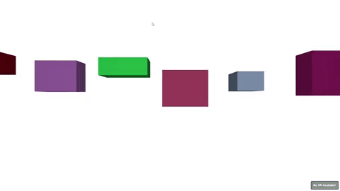

# Demo of using regl for WebVR.

Demo that demonstrates how to use
[regl](https://github.com/mikolalysenko/regl) with WebVR. Note that I
have only tested this in Google Daydream, with a Google Pixel, so it
may or may not work for other platforms, And I was only able to run it
in Chrome Canary, with WebVR enabled.

In the demo, the viewer is surrounded by a ring of moving cubes. By
pressing the button, VR can be entered.

Source code is in `index.js`




[Demo here](https://erkaman.github.io/webgl-rsm/webgl-rsm.html)

# Build and Run

First install all dependencies by doing

```bash
npm install
```

To then run the demo, do

```bash
npm run start
```
